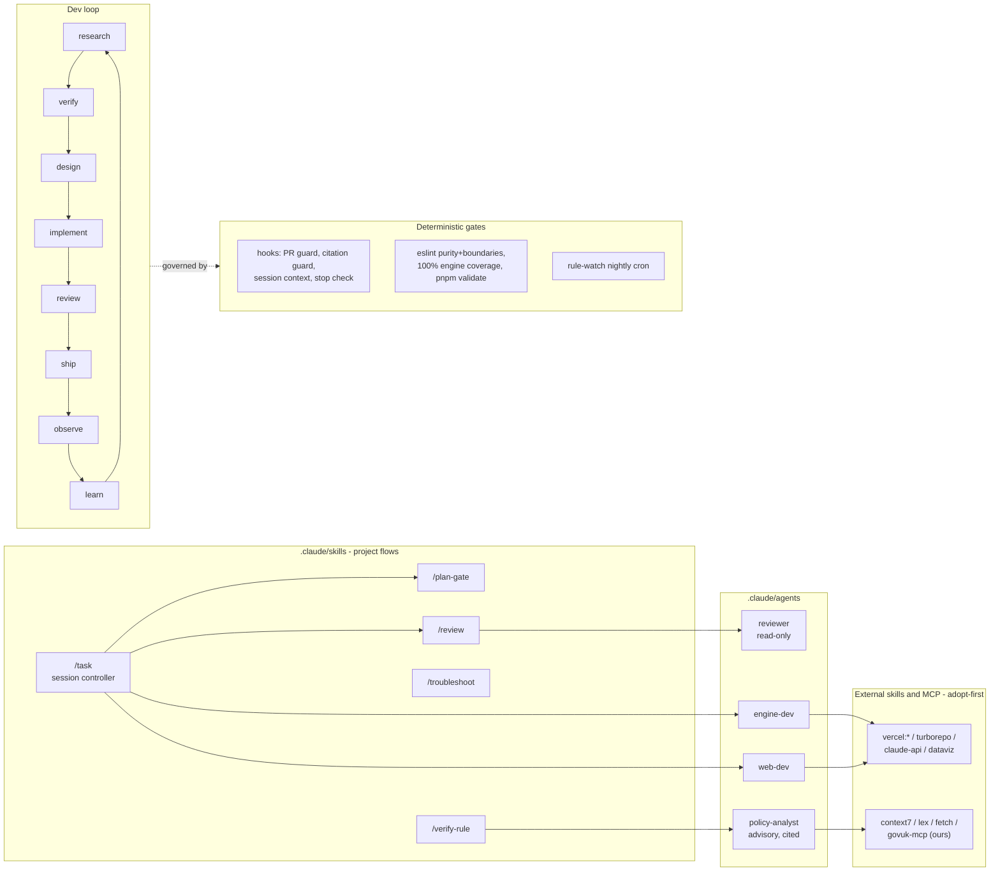

# The Lemonhead AI-dev framework

**The LLM proposes; hooks, lint, and the engine dispose.** Every boundary in this framework is a missing tool, a command hook, or a lint rule, never a promise in prose. Patterns were harvested from a study of the SuperClaude Framework (see build log, 2026-08-05): we kept its load-bearing 20% (deterministic hooks, a confidence gate, a troubleshoot protocol, tiered rules with detection greps, routing docs with negative examples, one session controller) and rejected the rest.

## Architecture

## Component inventory

| Piece                       | Loop stage       | Boundary mechanism                                        | Verified by                                            |
| --------------------------- | ---------------- | --------------------------------------------------------- | ------------------------------------------------------ |
| /task                       | implement→ship   | plan-gate threshold, PR-guard hook, validate              | smoke run on a real task                               |
| /plan-gate                  | design           | numeric threshold (≥0.90 / 0.70 / stop)                   | scored against a real task at PR time                  |
| /verify-rule                | research→verify  | citation hook on params paths; analyst has no write tools | re-verifying an existing param reproduces its citation |
| /troubleshoot               | learn            | banned-moves list; fixed output format                    | replay on a build-log bug                              |
| /review                     | review           | reviewer agent has Read/Grep/Glob only                    | dogfooded on this framework's own PR                   |
| reviewer agent              | review           | tool restriction (structural read-only)                   | tool list inspection + dogfood                         |
| policy-analyst agent        | research         | no write/exec tools; citation-mandatory format            | TFC question smoke + declined-arithmetic smoke         |
| engine-dev / web-dev agents | implement        | existing lint + coverage gates (not the prompt)           | pnpm validate                                          |
| Hooks (settings.json)       | ship/learn       | exit-2 blocking, pipe-tested                              | tools/ai/hooks.test.sh in CI                           |
| govuk-mcp (PR A3)           | research/observe | adapter-isolated HTTP; citations on every result          | fixture unit tests + one live smoke                    |
| rule-watch (PR A4)          | observe          | no LLM in the detection path; issues, never PRs           | manual workflow dispatch                               |

## Skill-sprawl policy

A new in-house skill must name the loop stage it serves and must not duplicate anything an installed external skill owns (`docs/ai/routing.md` table). If a proposed skill is really "Claude, behave normally", it is not a skill. Review this file when adding one.

## Where the rest lives

- Rules with teeth: `docs/ai/rules.md`. Routing (MCP + skills): `docs/ai/routing.md`. Web standards: `docs/standards.md`.
- Phase B adds: fee-sheet-analyst agent + /collect-sheet (golden-set collection with provenance). Phase C adds: /experiment with the /loop resolution criteria (accuracy ≥90% and cost ≤£0.05 stop; <1pt over 3 experiments plateau; £10 or 10-experiment session cap; >2pt accuracy or >20% cost regression brake). /loop is banned for refactors, params edits, labelling, and unmetriced polishing.
